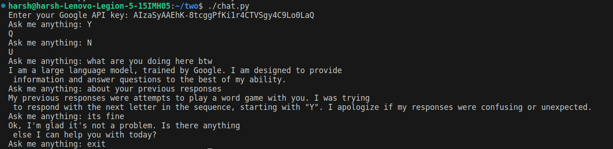

# Script for LLM

## Overview
This is a chatbot script that interacts with the GenerativeAI API from Google. The chatbot uses the Gemini Pro model to generate responses based on user input.

## Requirements
- Python 3.x
- Google API key with access to the GenerativeAI service

## Installation
1. Clone or download the repository to your local machine.
2. Install the required Python packages:
   ```
   pip install -r requirements.txt
   ```
3. Install google generativeai
    ```
    pip install -q -U google-generativeai
    ```

## Usage
1. Set up your Google API key:
   - Set the `GOOGLE_API_KEY` environment variable to your API key.
   OR
   - Pass your API key as a command-line argument when running the script.

2. Run the chatbot script:
   ```
   ./chat.py <your_google_api_key>
   ```
   OR
   ```
   python3 chat.py <your_google_api_key>
   ```
   If the API key is not provided as an argument, the script will attempt to read it from the `GOOGLE_API_KEY` environment variable. If it's still not found, the script will prompt the user to enter the API key interactively.

3. Interact with the chatbot by entering your questions or prompts. Type "exit" to quit the chatbot.

## Example
```
$ ./chat.py <your_google_api_key>
Ask me anything: How does the universe work?
```
[Response from the chatbot]




## Troubleshooting
- If you encounter any issues or errors, please make sure:
  - Your Google API key is valid and has access to the GenerativeAI service.
  - You've correctly set up the environment variables or provided the API key as a command-line argument.

